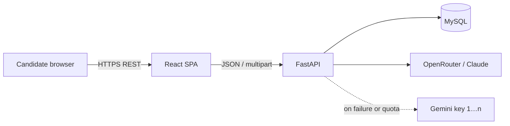
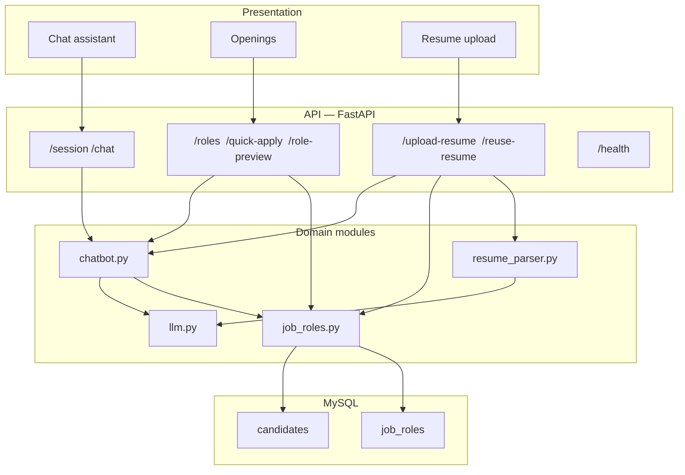
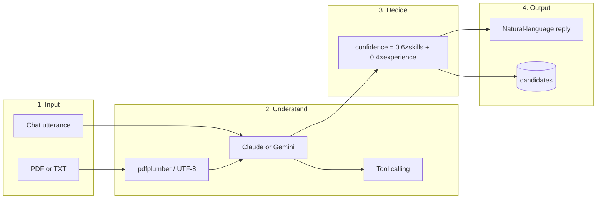
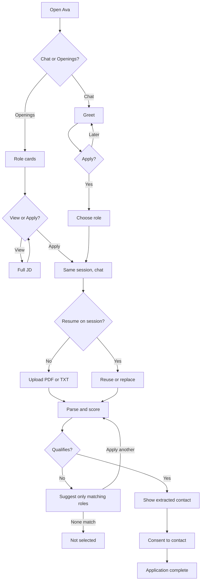
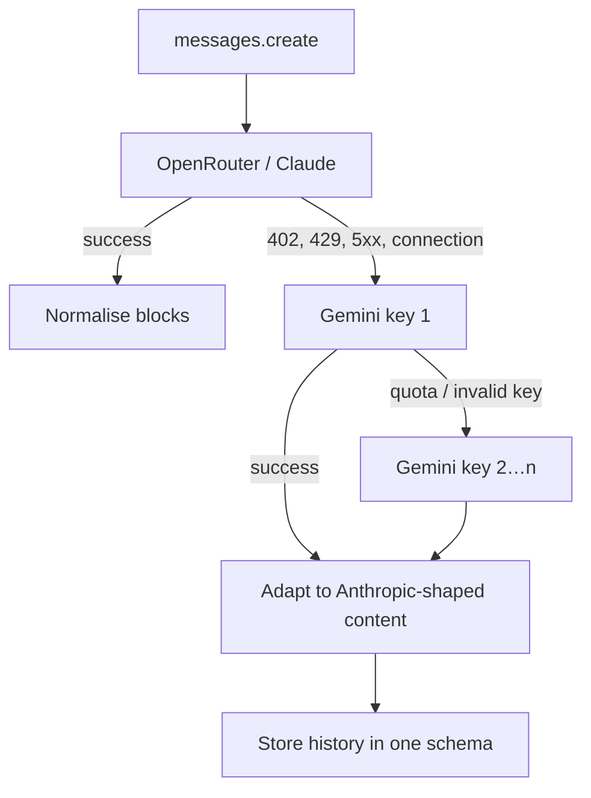
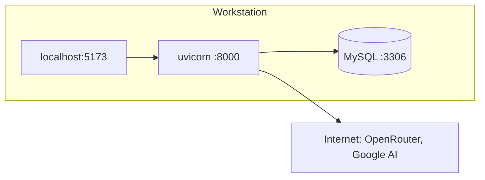

# System architecture — Ava

**Product:** AI-powered resume parser and job-application chatbot  
**Audience:** Conversive.ai Assignment 101 (system design)

This document describes how the running system is structured: components, request paths, the NLP pipeline, data, and qualification. Setup and API usage are in `README.md`. Product rationale and challenges are in `docs/Write-up.pdf`.

---

## 1. Design goals

| Goal | How it is met |
| --- | --- |
| Modular, maintainable code | Parsing, dialogue, and matching live in separate modules; FastAPI only composes them |
| Flexible language understanding | LLM + tool calling instead of a keyword state machine |
| Explainable hiring decision | Closed-form confidence score; the model does not grant “qualified” |
| Reliable demo under free-tier APIs | OpenRouter (Claude) first, then Gemini with multiple keys |
| Assignment roles and persistence | Three seeded openings in MySQL; candidate rows after parse |

`session.stage` is a **UI hint** (when to show upload, when screening is done). It is not a rigid dialogue automaton. The model may still answer hiring questions at any point, subject to the system prompt.

---

## 2. Context

External actors: the candidate. External services: LLM providers. The only datastore in this deployment is MySQL. Chat sessions are held in process memory (`SESSIONS` in `main.py`).

---

## 3. Logical architecture

| Module | Responsibility | Does not own |
| --- | --- | --- |
| `frontend/` | Layout, tabs, upload widget, rendering of replies and match sidebar | Scoring, prompts, SQL |
| `main.py` | HTTP, CORS, session map, file temp disk, error mapping | Business rules |
| `chatbot.py` | System prompt, tools, tool loop, stage/UI hints, match narration | PDF bytes, SQL schema |
| `resume_parser.py` | Bytes → text → JSON profile | Roles, chat history |
| `job_roles.py` | Seeded role CRUD, overlap math, `candidates` writes | LLM calls |
| `llm.py` | Provider selection, Gemini adaptation, history normalisation | Domain objects |
| `models.py` / `database.py` / `seed.py` | ORM, engine, idempotent role seed | HTTP |

This split matches requirement 4 of the assignment (parsing, bot logic, job-role matching).

---

## 4. Frontend

Single-page app (React 18 + Vite + Tailwind).

| Surface | Behaviour |
| --- | --- |
| Chat | Session created on load; opening “Hi” produces Ava’s greeting. Messages go to `POST /chat`. Suggestion chips replay as user turns. |
| Openings | `GET /roles`. **View** calls `POST /role-preview` (full JD in chat). **Apply** calls `POST /quick-apply` and switches tab. |
| Upload | Shown when the session is waiting for a file. `POST /upload-resume` with `.pdf` or `.txt`. |
| Sidebar | Extracted profile and per-role confidence (Applied / Not selected). |
| Header | Active provider label (`Claude` or `Gemini`) from `model_label`. |

The browser never talks to OpenRouter or Gemini. All model traffic is server-side.

---

## 5. Request flows

### 5.1 Chat turn

1. Client sends `{ session_id, message }`.
2. `handle_message` appends the user turn and calls `client.messages.create` with the system prompt and tool schemas.
3. If the model returns `tool_use`, `chatbot.py` executes the tool against `job_roles` / session state and continues the loop.
4. The assistant text plus `session_snapshot` (stage, profile, matches, suggestions, provider) is returned.

**Tools**

| Tool | Effect |
| --- | --- |
| `list_job_roles` | Returns seeded openings (used for targeted questions, not a dump of every JD in chat) |
| `get_role_details` | One role’s full description from the database |
| `request_resume_upload` | Sets intended role; asks for upload or reuse/replace if a file is already on the session |
| `reuse_uploaded_resume` | Re-scores the stored profile without another parse |
| `record_contact_preference` | Writes `agreed_to_contact` on the candidate row |

### 5.2 Resume upload

1. Multipart file is written to a temporary path; suffix must be `.pdf` or `.txt`.
2. `parse_resume` extracts text (`pdfplumber` or UTF-8), then the LLM returns a JSON object (JSON mode, retry without JSON mode, fence stripping).
3. `evaluate_profile` scores **all** roles, persists or updates `candidates`, sets applied/rejected lists.
4. `narrate_match` asks the LLM to phrase the outcome from the **payload only** (no invented contact or extra jobs).
5. Snapshot returns to the UI.

Upload cannot be a chat tool: the model never receives the file bytes.

### 5.3 Openings shortcuts

`/quick-apply` and `/role-preview` reuse the same session object as chat so View/Apply do not start a disconnected conversation.

---

## 6. NLP pipeline

NLP here means: turn unstructured language into structured actions and fields, then generate a reply. The implementation is transformer-based LLMs via prompting, not a spaCy pipeline or Rasa NLU.

| Step | Chat | Resume |
| --- | --- | --- |
| Input | User text | File bytes |
| Normalise | History as Anthropic-style messages | Plain text |
| Understand | Intent via tools (apply, JD, consent) | Entities: name, email, phone, skills, education, years |
| Decide | Tool side effects | Formula + dual threshold |
| Generate | Assistant message | Narration + optional contact question |

Off-topic prompts are refused in the system prompt (hiring scope only).

---

## 7. User flow

---

## 8. Language-model layer

`llm.py` exposes a single `client.messages.create(...)` used by both chat and parse.

Gemini function responses are mapped to `text` / `tool_use` blocks. Session history is normalised so a mid-conversation provider switch does not raise type errors.

---

## 9. Data

### 9.1 MySQL

**`job_roles`** (reference, upserted by `seed.py` on startup)

| Field | Content |
| --- | --- |
| `title` | Developer, Tester, Data Analyst |
| `required_skills_json` | Required skill list |
| `nice_to_have_json` | Optional skills (display / JD only; not in the score) |
| `qualifications` | Education line |
| `min_experience_years` | e.g. 1.0 or 0.5 |
| `description`, `responsibilities_json` | JD body |

**`candidates`** (one row per parsed application in a session)

Profile fields, `matched_role`, `confidence`, `qualifies`, `agreed_to_contact` (null until answered), `created_at`.

### 9.2 In-memory session

`Session` holds history, intended role, profile, match lists, UI cards/suggestions, and `candidate_id`. Restarting Uvicorn clears chats; MySQL rows remain. A production deployment would move this map to Redis or a session table.

---

## 10. Qualification (matching service)

Implemented only in `job_roles.match_candidate_to_role`.

\[
\mathrm{skill\_ratio} = \frac{\lvert \text{required skills present} \rvert}{\lvert \text{required skills} \rvert}
\]

\[
\mathrm{exp\_score} = \min\bigl(\mathrm{years} / \max(\mathrm{min\_years},\,0.1),\; 1\bigr)
\]

\[
\mathrm{confidence} = 0.6 \cdot \mathrm{skill\_ratio} + 0.4 \cdot \mathrm{exp\_score}
\]

**Qualifies** iff `confidence ≥ 0.5` **and** `skill_ratio ≥ 0.5`.

Skill comparison is normalised (lowercase, punctuation stripped) with aliases (`js` → javascript, `react.js` → react, `mysql` → sql). Nice-to-have skills do not affect the ratio. `score_all_roles` ranks every opening; alternatives shown in chat are those with `qualifies == true` other than the role just applied for.

---

## 11. Cross-cutting concerns

| Topic | Current behaviour |
| --- | --- |
| CORS | Allow-all origins (local demo). Restrict in production. |
| Secrets | `.env` (not in Git). Keys never sent to the browser. |
| Files | Temporary upload path; suffix allow-list `.pdf` / `.txt`. |
| Failures | Parse errors → HTTP 422. LLM outage after fallbacks → HTTP 503. |
| Tests | pytest against SQLite; LLM mocked. Formula and APIs covered without live providers. |

---

## 12. Component diagram (deployment)

Minimum hardware matches the assignment (dual-core, 8 GB). No local GPU is required; inference is remote.